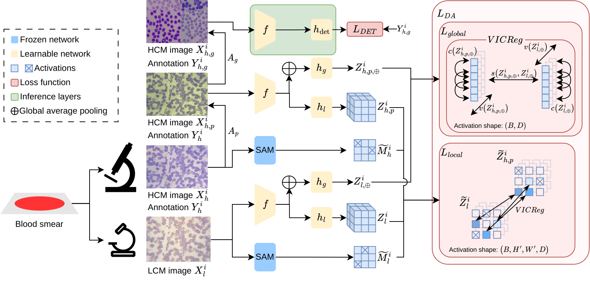

# MaLDAM: Masked Localized Domain Adaptation for Malaria Detection in Low-Cost Microscopic Images

This repository contains the code of a cell-aware domain adaptation framework (**MaLDAM**) which adapts a malaria-parasite detector from **expensive, high-cost microscope (HCM)** images to **cheap, low-cost microscope (LCM)** images, using global and masked local feature alignment between paired HCM and LCM images.

---

## Overview

Malaria diagnosis in resource-deficient regions increasingly relies on LCMs. However, labeling LCM images directly is laborious due to poor image quality and a limited field of view. Consequently, detectors are often trained on images from expensive HCM and generalize poorly to the noisier, lower-resolution optics of an LCM. Prior domain-adaptation approaches mostly align *global* image features, but malaria detection is a dense prediction task where the local, cell-level appearance of a parasite is what actually drives diagnosis. Thus, global alignment alone leaves the diagnostically relevant regions under-adapted.

MaLDAM closes this domain gap **during training**, not as a separate fine-tuning stage: every training step jointly optimizes

1. a standard YOLOv5 detection loss (box, objectness, class) for locating and staging malaria parasites (*ring*, *trophozoite*, *schizont*, *gametocyte*), and
2. a **VICReg-based local domain-adaptation loss** that pulls the backbone's HCM and LCM feature representations of the *same physical sample* together, with the local (patch-wise) term restricted to the parasite-containing (cell-aware) regions of the image via a precomputed foreground mask, so the adaptation signal focuses on diagnostically relevant cells rather than background variation.

Microscopy-specific augmentations (blur, noise, stain, resolution, Fourier-domain jitter, etc., see [Methodology](#methodology)) further improve robustness to LCM imaging artefacts. On the M5 dataset this improves mAP by **8.5** at **1000×**, **7.3** at **400×**, and **3** at **100×** magnification over the prior state of the art, with no additional inference latency.

## Methodology

<p align="center">
  
</p>

MaLDAM trains on paired HCM/LCM images of the same blood-smear field (only the HCM side is labeled), so the model learns not just *where* cells are but *which* cells correspond across domains.

**Pipeline.** Offline, a SAM based foreground mask is precomputed per image (train-time only, no inference cost). Each HCM image then yields two views — a photometrically degraded one (blur/noise/stain, simulating LCM) used for domain adaptation, further geometrically augmented (crop/mixup/mosaic) for detection — while the paired LCM image stays unaugmented. All three views share one detection backbone.

**Losses.** The geometrically-augmented HCM features feed a standard detection head for the usual detection loss. In parallel, the degraded-HCM and LCM features are aligned with VICReg (a non-contrastive invariance/variance/covariance objective, avoiding the need for negative samples) at two scales: **global** (pooled whole-image embeddings) and **masked local** (patch embeddings restricted to the foreground mask). Global and local terms are combined and added to the detection loss, backpropagated jointly each step.

## Repository Structure

```
MaLDAM/
├── main.py                        # entry point: single-GPU and DDP training/evolution
├── config/
│   └── train_contrastive.yaml     # Config for running MaLDAM
├── data/
│   ├── m5_400x.yaml                # M5 dataset split, 400x zoom
│   ├── m5_100x.yaml                # M5 dataset split, 100x zoom
│   └── m5_1000xa.yaml              # M5 dataset split, 1000x zoom
├── src/
│   ├── config.py                   # YAML <-> OmegaConf load/save
│   ├── contrastive_trainer.py      # ContrastiveTrainer: the full training/validation/benchmark loop
│   ├── models/                     # Detection model definition
│   └── utils/
│       ├── dataloaders_contrastive.py  # HCM/LCM-paired dataset + foreground mask loading
│       ├── dataloaders.py              # standard dataloader
│       ├── vicregl/                    # VICRegL head, loss, nearest-neighbor matching utils
│       ├── feature_matching.py         # nearest-neighbor feature matching primitives
│       ├── augmentations.py            # Augmentations for domain adaptation
│       ├── loss.py                     # Detection loss
│       ├── val.py                      # Detection validation / benchmarking loop
│       └── metrics.py, plots.py, ...   # AP/PR computation, plotting
└── requirements.txt
```

## Installation

```bash
git clone <this-repo-url> MaLDAM
cd MaLDAM
python -m venv .venv && source .venv/bin/activate   # or conda create -n maldam python=3.10
pip install -r requirements.txt
```

## Dataset

MaLDAM trains on the **M5 malaria microscopy dataset**, which pairs HCM and LCM captures of the same blood-smear field at multiple zoom levels (100x/400x/1000x).

- Download: https://github.com/intelligentMachines-ITU/LowCostMalariaDetection_CVPR_2022

Expected directory layout (relative to a `path:` root set in the dataset YAML):

```
<path>/
├── Images/
│   ├── HCM/{train,val,test}/{100x,400x,1000x}/*.png
│   └── LCM/{train,val,test}/{100x,400x,1000x}/*.png
├── Labels/            # YOLO-format .txt boxes, mirrored under the same HCM/LCM/split/zoom tree
└── Masks/              # per-image parasite foreground masks (.npy), same tree, used for masked local matching
                         # precomputed offline (the paper uses Cellpose-SAM); loaded as-is at train time.
```

Each dataset YAML (`data/m5_*.yaml`) declares:

```yaml
path: <dataset-root>/Images/          # root the train/val/test/benchmark paths below are resolved against
train: 'HCM/train/400x'               # detection + contrastive training split
val:   'LCM/val/400x'                # validation split (cross-domain: LCM)
test:  'LCM/test/400x'

benchmark:                            # optional cross-dataset generalization checks, run once at the end of training
  BBBC041: 'processed_data/BBBC041/test'
  IML: 'processed_data/iml-malaria'

names:
  0: "ring"
  1: "trophozoite"
  2: "schizont"
  3: "gametocyte"
```

## Results

Evaluated on the M5 dataset under the HCM→LCM protocol: train on HCM labels only, test cross-domain on LCM, at three magnifications (mAP@0.5). MaLDAM matches CodaMal's inference cost (21.4M params, 8.9ms) while improving mAP by **8.5** (1000×), **7.3** (400×), and **3** (100×) over CodaMal, and approaches or surpasses the fully-supervised LCM→LCM upper bound.

| Method                              | Params (M) | Inf. (ms) | 1000× | 400× | 100× |
|--------------------------------------|:----:|:----:|:----:|:----:|:----:|
| YOLOv5 (supervised LCM→LCM, upper bound) | 20.9 | 8.9  | 62.6 | 61.9 | 30.1 |
| Sultani et al. [20] CVPR'22          | 43.7 | 184  | 37.5 | 33.8 | –    |
| FARS+ [10] CBM'24                    | 49.5 | 17.8 | 43.7 | 45.0 | –    |
| CodaMal [6] ICIP'24                  | 21.2 | 8.9  | 53.6 | 48.7 | –    |
| CodaMal [6] ICIP'24 (reproduced)     | 21.2 | 8.9  | 51.8 | 48.3 | 28.3 |
| **MaLDAM (ours)**                    | 21.4 | 8.9  | **62.1** | **56.0** | **31.3** |

## Training

### Single-GPU

```bash
python main.py --config_path config/train_contrastive.yaml
```

Override the device or config path without editing the YAML:

```bash
python main.py --config_path config/train_contrastive.yaml -d 0
```

### Multi-GPU (DDP)

Set `parallel: true` in the config, then launch with `torchrun`, listing every physical GPU you want the job to use in `CUDA_VISIBLE_DEVICES`:

```bash
CUDA_VISIBLE_DEVICES=0,1 torchrun --standalone --nproc_per_node=2 main.py \
    --config_path config/train_contrastive.yaml
```

### Resuming a Run

```yaml
resume: true                              # resume the most recent run in <out_dir>
# or
resume: runs/train/exp/weights/last.pt    # resume a specific checkpoint
```

The resumed run adopts the exact config that produced the checkpoint (saved alongside it as `config.yaml`), so hyperparameters stay consistent across the resume.

## Outputs

Each run writes to `<out_dir>/<name>/` (auto-incremented unless `exist_ok: true`):

```
runs/train/<name>/
├── config.yaml              # exact resolved config used for this run (for reproducibility/resume)
├── weights/
│   ├── best.pt               # checkpoint with the best validation fitness
│   └── last.pt
├── results.csv                # per-epoch losses and metrics
├── labels.jpg, labels_correlogram.jpg
├── PR_curve.png, F1_curve.png, P_curve.png, R_curve.png
└── M5/, BBBC041/, IML/        # per-benchmark evaluation artifacts and evaluation_results.txt
                                # written once at the end of training (see Cross-Dataset Benchmarks)
```

## Citation

If you use this repository, please cite MaLDAM alongside the two works it builds on:

```bibtex
@inproceedings{fernando2026maldam,
  title     = {MaLDAM: Masked Localized Domain Adaptation for Malaria Detection in Low-Cost Microscopic Images},
  author    = {Fernando, Muditha and Rathnasekara, Tishan and Nazar, Saeedha and Perera, Avishka and Kaluarachchi, Tharindu},
  booktitle = {HemaRAI},
  year      = {2026}
}
```

## Acknowledgements

- Detection backbone and training loop adapted from [Ultralytics YOLOv5](https://github.com/ultralytics/yolov5).
- Contrastive domain-adaptation formulation builds on [CodaMal](https://github.com/intelligentMachines-ITU/LowCostMalariaDetection_CVPR_2022) (Dave et al.) and [VICRegL](https://github.com/facebookresearch/VICRegL) (Bardes et al.).
- Foreground cell masks precomputed with [Cellpose-SAM](https://github.com/MouseLand/cellpose) (Pachitariu et al.), chosen over classical thresholding for robustness to LCM imaging artefacts.
- M5 dataset from [Towards Low-Cost and Efficient Malaria Detection](https://github.com/intelligentMachines-ITU/LowCostMalariaDetection_CVPR_2022).
